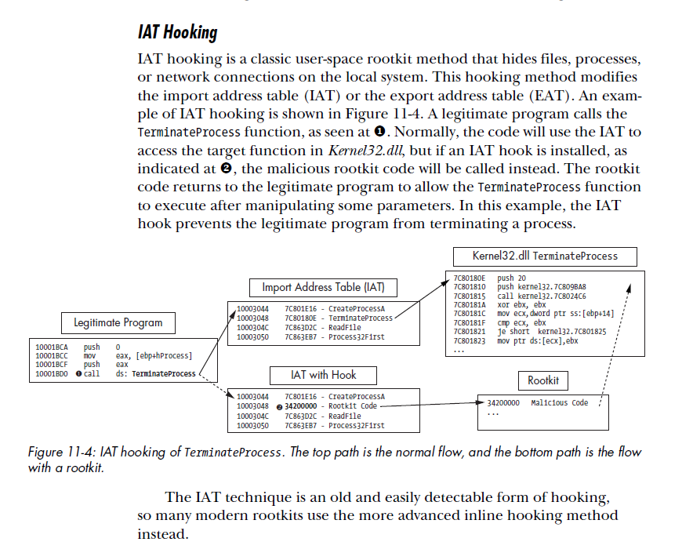
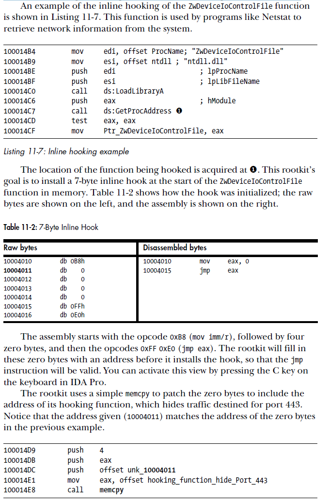
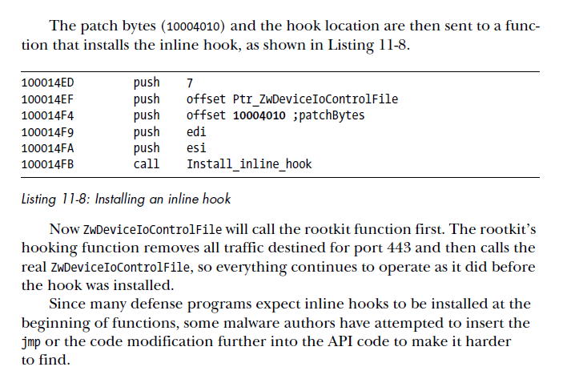

# IAT & Inline Hooking

**<u>IAT</u>**

**<u>Inline</u>**

Inline hooking overwrites the API function code contained in the imported
DLLs, so it must wait until the DLL is loaded to begin executing. IAT hooking
simply modifies the pointers, but inline hooking changes the actual function
code.

A malicious rootkit performing inline hooking will often replace the start of the code with a jump that takes the execution to malicious code inserted by the rootkit. Alternatively, the rootkit can alter the code of the function to damage or change it, rather than jumping to malicious code.

